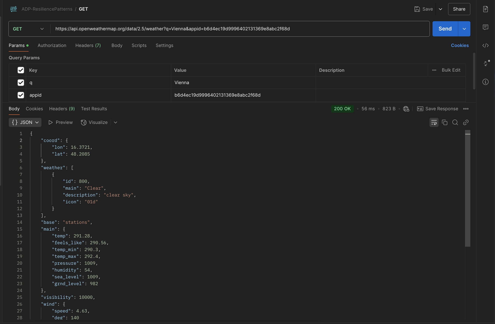

# Weather Forecasting Service

## 1- Introduction:

The problem is solving the unreliability of external weather APIs, 
which are often prone to downtime or slow responses. Users depend on accurate,
real-time weather information, and that's need a resilient system,
that can handle failures in the weather service carefully.
The application will be used by users who want to get current weather data for any city. 
It should still work even if the weather API service experiences issues.

## 2- Implemented Resilience Patterns:

    * Circuit Breaker Pattern

    * Retry Pattern

    * Timeout Pattern

## 3- Features:

    Fetch Current Weather Data: The app will retrieve weather data for a specified city from an external API.

    The Resilience Mechanisms:

        Circuit Breaker: If the weather API fails repeatedly, the circuit breaker will stop further requests to prevent overloading the external service and reduce failures.

        Retry: If a request to the weather API fails temporarily (e.g. due to network glitches, or anthor reason), the system will retry the request for a specified number of attempts.

        Timeout: If the weather API takes too long to respond, the request will be timed out and canceled to avoid hanging the system.

## 4- Implementation:

    - CircuitBreaker:
        . The CircutBreaker class will track the failure count and timeouts.
        . If the request fails too many times in a row, will stop sending requests to an external API.

    - Retry Pattern:
        . The retry pattern will automatically retry failed API requests a specified number of times, 
          with delays between retries (e.g., exponential backoff).
        . This is useful in case of temporary failures.

    - Timeout Pattern:
        . The timeout pattern ensures that if the weather API does not respond within a specified time,
          the request is aborted, preventing the system from hanging indefinitely.
        . Timeout Class will execute API calls asynchronously with a timeout.

## 5- Workflow:

### Main Process:

Check the Circuit Breaker to see if the system should continue calling the API. 
If the circuit is closed, use the Retry pattern to retry the API call if it fails temporarily.
Use the Timeout pattern to ensure that the request is canceled if it takes too long.

### Application Process:

    The user requests the weather data for a city.

    Before making the API request, the Circuit Breaker checks if it's safe to call the API.

    If safe, the request is made using the Retry pattern, which retries on failure.

    If the request exceeds the timeout, it will be aborted using the Timeout pattern.

    If the API succeeds, the weather data is returned. If it fails, the user is notified accordingly.

## 6- Testing:

I created API-Key on https://openweathermap.org so let's test it.

## 7- Final Result:

Weather Data For the city : Vienna:
{"coord":{"lon":16.3721,"lat":48.2085},"weather":[{"id":800,"main":"Clear","description":"clear sky","icon":"01d"}],"base":"stations","main":{"temp":292.51,"feels_like":291.89,"temp_min":290.86,"temp_max":293.48,"pressure":1009,"humidity":53,"sea_level":1009,"grnd_level":982},"visibility":10000,"wind":{"speed":4.63,"deg":140},"clouds":{"all":0},"dt":1744550911,"sys":{"type":2,"id":2037878,"country":"AT","sunrise":1744517304,"sunset":1744566073},"timezone":7200,"id":2761369,"name":"Vienna","cod":200}

    